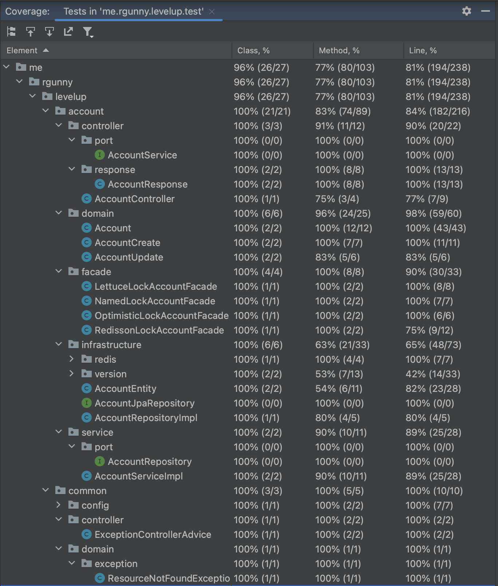
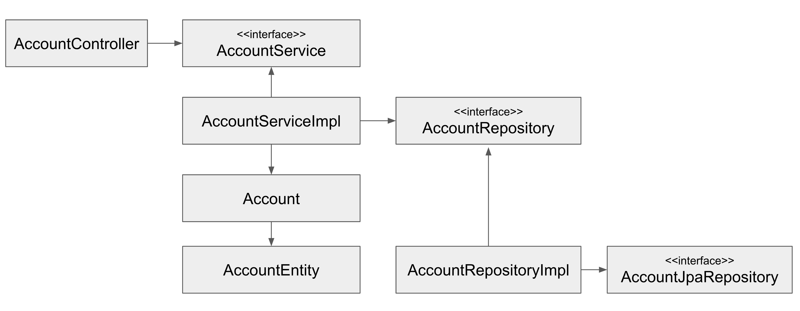

# levelup


## 1. 주제

- WHY

    ```
    - 계좌이체 서비스 기반 백앤드 서버 아키텍처 확장 프로젝트
    ```

- 기술 스택
- Java 17, SpringBoot 3.1.1
- Spring Data JPA, Redis, MySQL
- Junit5
- Docker


## 아키텍처
### 테스트 커버리지



### 백앤드 객체 의존성



